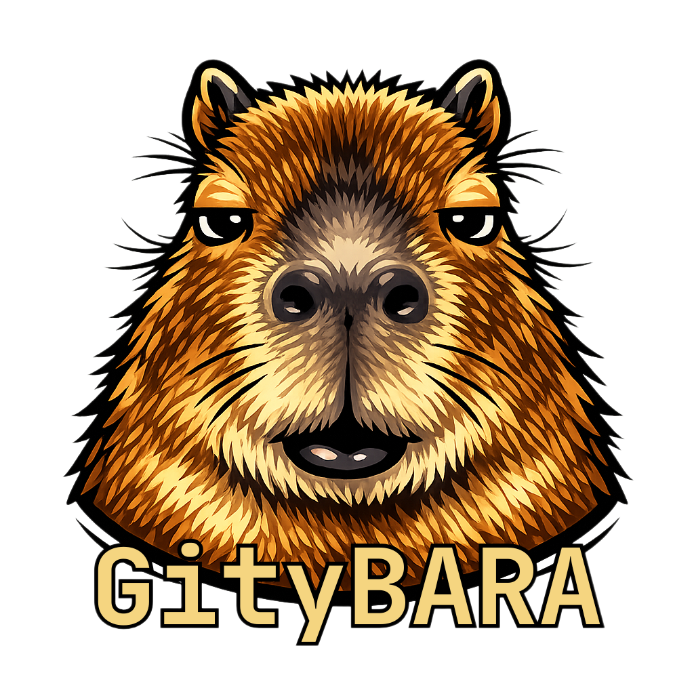
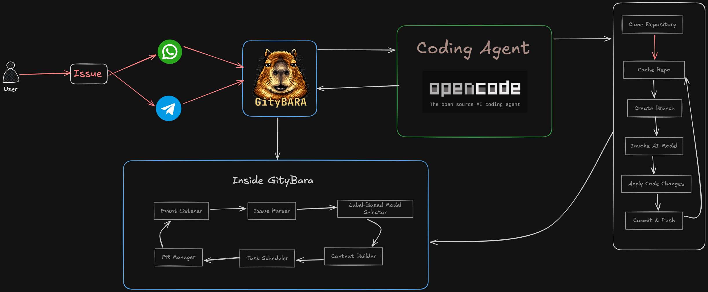

<div align="center">
  
  <br>
  <h2>An AI coding assistant that actually ships code.</h2>
  <p><b>Stop prompting. Start delegating.</b></p>
  
  <p>
    
    
    
    
  </p>

  <p>
    <b>Gitybara is an autonomous AI developer built on top of OpenCode.</b><br>
    Most AI tools help you write code. Gitybara actually does the development.<br>
    It turns issues into branches, code, and pull requests — automatically.<br>
    <i>Instead of chatting with AI, you assign it work.</i>
  </p>
</div>

---

## 🚀 What Gitybara Does

Gitybara transforms your GitHub workflow into an AI-driven development system.

1. You create an issue (or send a message via WhatsApp / Telegram).
2. Gitybara reads the task.
3. It selects the right AI model using labels.
4. It creates a branch.
5. It implements the solution using OpenCode.
6. It opens a pull request.
7. You review and merge.

That’s it.

No copy-paste.
No terminal juggling.
No AI chat babysitting.

---

## 🧠 Why It’s Different

Most AI coding assistants are:
- Chat-based
- Interactive
- Suggestion-driven
- Synchronous

Gitybara is:
- Issue-driven
- Autonomous
- Workflow-native
- Asynchronous
- Outcome-focused (PR ready)

It doesn’t assist.
It executes.

---

## ⚙ Core Capabilities

- 🔁 **Issue → PR Automation**  
  Fully automated development from GitHub issues.

- 🏷 **Model Control via Labels**  
  Choose AI behavior directly from GitHub using labels.

- 🌿 **Git-Native Execution**  
  Creates branches, commits changes, and opens PRs automatically.

- 📱 **Messaging to Code**  
  Send ideas via WhatsApp or Telegram — Gitybara converts them into issues and executes.

- 🔄 **Feedback Loop**  
  Request changes in the PR. Gitybara updates the branch automatically.

---

## 🛠 Installation

```bash
git clone https://github.com/your-username/gitybara.git
cd gitybara
npm install
npm run build
npm link

# Install Chrome for WhatsApp bridge
npx puppeteer browsers install chrome
````

### Prerequisites

* OpenCode installed and available in PATH
* GitHub Personal Access Token (`repo`, `workflow`)
* Git 2.30+ (worktree support)
* **Chrome/Chromium** (Required for WhatsApp integration. Install via `npx puppeteer browsers install chrome`)

---

## 🚦 Getting Started

### 1️⃣ Initialize

```bash
gitybara init
```

### 2️⃣ Start the Agent

```bash
gitybara start
```

Gitybara now listens for issues labeled `gitybara` and executes them automatically.

---

## 📱 Mobile Workflow

Text Gitybara:

> “Add JWT authentication to the API”

It:

* Creates a GitHub issue
* Confirms the task
* Starts development
* Sends you the PR link when ready

You review.
You merge.
Done.

---

## 📐 Architecture

<div align="center">
  
</div>

Gitybara acts as the **Orchestrator** between:

* GitHub
* Messaging platforms
* OpenCode runtime Agent
* Your repository

It coordinates.
OpenCode executes.
GitHub becomes the control panel.

---

## 📊 CLI Commands

| Command           | Description                 |
| ----------------- | --------------------------- |
| `gitybara init`   | Connect repositories        |
| `gitybara start`  | Start background agent      |
| `gitybara stop`   | Stop agent                  |
| `gitybara status` | View active jobs            |
| `gitybara config` | Configure tokens & settings |

---

<div align="center">
  <sub>Autonomous development inside GitHub.</sub>
  <br>
  <sub><b>From issue to PR — automatically.</b></sub>
</div>
